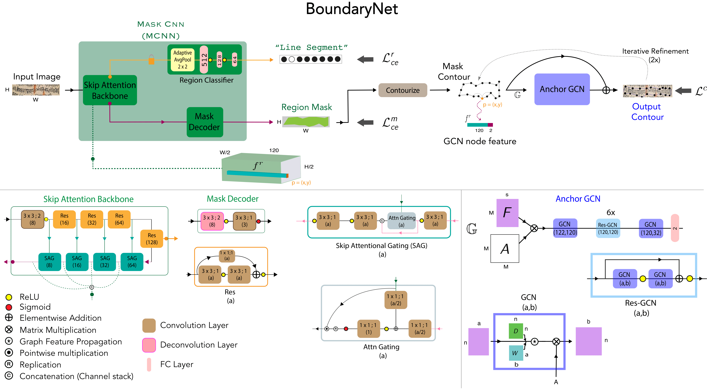

<div align="center">

<samp>

<h1> BoundaryNet </h1>

<h2> An Attentive Deep Network with Fast Marching Distance Maps for Semi-automatic Layout Annotation </h2>

</samp>

**_[ICDAR 2021](https://icdar2021.org/)_ [ORAL PRESENTATION]**

| **[ [```Paper```](<https://drive.google.com/file/d/1lmnuGCjFA7HOJX2wLjklESwqJzbW4tXR/view?usp=sharing>) ]** | **[ [```Website```](<https://ihdia.iiit.ac.in/BoundaryNet/>) ]** |
|:-------------------:|:-------------------:|


<b>Figure</b> : BoundaryNet architecture from different abstract levels: Mask-CNN, Anchor GCN.
</br>
We propose a novel resizing-free approach for high-precision semi-automatic layout annotation. The variable-sized user selected region
of interest is first processed by an attention-guided skip network. The network optimization is guided via Fast Marching distance maps to obtain a good quality
initial boundary estimate and an associated feature representation. These outputs are processed by a Residual Graph Convolution Network optimized using Hausdorff
loss to obtain the final region boundary.
</div>

--

<div align="center">
    <a href="https://youtu.be/W30EOByoGks">
        
    </a>
<br>
<table>
    <tr>
        <td>
            <a href="https://youtu.be/W30EOByoGks" target="_blank">
                
            </a>
        </td>
    </tr>
    <tr>
        <th><samp>Teaser Video (Click on Image above)</samp></th>
    </tr>
</table>
</div>

--

# Dependencies and Installation

The BoundaryNet code is tested with

- Python (`3.5.x`)
- PyTorch (`1.0.0`)
- CUDA (`10.2`)

Please install dependencies by

```bash
pip install -r requirements.txt
```

# Usage

```cd CODE```

## Initial Setup:

- Download the Indiscapes dataset - **[[`Dataset Link`](https://github.com/ihdia/indiscapes)]**
- Place the
    - Dataset Images under `data` directory
    - Pretrained BNet Model weights in the `checkpoints` directory
    - JSON annotation data in `datasets` directory


## Training

### BoundaryNet

1. MCNN:
```
bash Scripts/train_mcnn.sh
```
2. Anchor GCN:
```
bash Scripts/train_agcn.sh
```
3. End-to-end Fine Tuning:
```
bash Scripts/fine_tune.sh
```
- For all of the above scripts, corresponding experiment files are present in ```experiments``` directory.
- Any required parameter changes can be performed in these files.

### Baselines

Refer to the [Readme.md](configs/Readme.md) under the configs directory for modified baselines - CurveGCN, PolyRNN++ and DACN.

## Inference

### Test Set
To perform inference and get quantitative results on the test set.

```
bash Scripts/test.sh 
```
> Check the qualitative results in ```visualizations/test_gcn_pred/``` directory.

### Custom Images

- Add Document-Image path and Bounding Box coordinates in ```experiments/custom_args.json``` file.
- Execute -
```
 python test_custom.py --exp experiments/custom_args.json
```
> Check the corresponding instance-level boundary results at ```visualizations/test_custom_img/``` directory.

## Fine Tuning on Custom Dataset

1. Add dataset images in ```data``` folder and Json annotations in ```datasets/data_splits/```.

2. Fine Tune MCNN

- Modify parameters in ```experiments/encoder_experiment.json``` file
- Freeze the Skip Attention backbone
 ```
 bash train_mcnn.sh 
 ``` 
> Check the corresponding instance-level boundary results at ```visualizations/test_encoder_pred/``` directory.

3. Train AGCN from scratch

- From new MCNN model file in ```checkpoints```
- Modify the MCNN model checkpoint path in ```models/combined_model.py```
 ``` 
 bash train_agcn.sh
 ```
> Check the corresponding instance-level boundary results at ```visualizations/test_gcn_pred/``` directory.


# Citation

If you use BoundaryNet, please use the following BibTeX entry.

```bibtex
@inproceedings{trivedi2021boundarynet,
    title = {BoundaryNet: An Attentive Deep Network with Fast Marching Distance Maps for Semi-automatic Layout Annotation},
    author = {Trivedi, Abhishek and Sarvadevabhatla, Ravi Kiran},
    booktitle = {International Conference on Document Analysis Recognition, {ICDAR} 2021},
    year = {2021},
}
```

# Contact

For any queries, please contact [Dr. Ravi Kiran Sarvadevabhatla](mailto:ravi.kiran@iiit.ac.in.)

# License

This project is open sourced under [MIT License](LICENSE).
